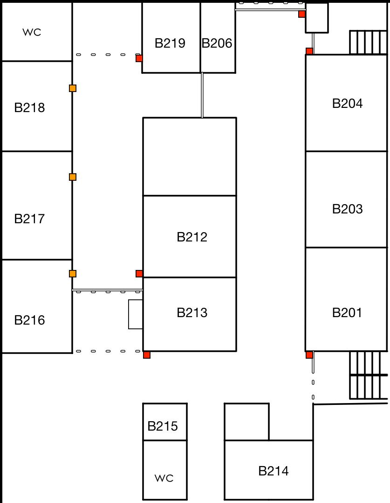

## 示意圖

> 本圖只是簡略示意圖。

## 圖示說明

- 橘色正方形為門禁卡機。
- 紅色正方形為鐵捲門開關。
- 虛線表示的是鐵捲門。
- 雙直線是一般的門。
- B216 外面的黑色正方形是電箱。

## 後棟

1. 基本上一般在晚班時，如果後棟（B216~B218）到九點下班之前，都沒有借用或是上課的話，就可以先把教室給關起來。
2. 關後棟教室時，要先查看每一間的窗戶是否有鎖好、冷氣是否有關好、每一台主機是否都已經關機了，最後才可以把教室內的總電源關掉。
3. 每間教室內都有兩到三個電箱，大部份都在教室內最前面或最後面的牆上。
4. 大的電箱是地上排插的開關，最上面的開關不用關，其他的開關除了有貼標籤的不用關外，其他都關掉。
5. 有一些比較小的電箱裡面只有一到兩個開關，那是冷氣或網路交換器的電源開關，關掉冷氣的就好，網路交換器電源不用關。
6. 電源關掉後，把門關上確認電磁鎖鎖好後，再用鑰匙把門鎖好。
7. 確認方式是門關上後，看門能不能打開，直接轉門鎖就可以知道了。
8. 關 B216 外面那道鐵捲門，人在外面到鐵捲門下下來後，就往裡面走順便把外面的大電箱關掉。
9. B216 外的電箱要關的時候，要先按下電箱外面的兩個按鈕，才能關掉裡面的開關，一樣關掉沒貼標籤的，最上面的不要動，共六個開關。
10. 關好後把裡面的那道玻璃門關起來，這玻璃門有兩個鎖，鑰匙鎖上後，門栓栓上，門閂只要栓其中一邊就好，再把裡面的鐵捲門下下來。
11. 接下來可以下廁所外面鐵捲門，在下之前要大聲地詢問廁所裡是否還有人，如果有人要等到他出來才可以下鐵捲門。
12. 後棟走廊的電燈，通常要留下轉角的那盞電燈。
13. B219 外面的玻璃門，關起來後按照門上面的指示關起來並把門栓栓好，假如 B219 裡面還有人，可以問看看是否要由他們關門，不然門就先關一半起來就好。

## 前棟

1. 在商管通往藍白小鎮的那個出口，有兩道鐵捲門還有一扇玻璃門，鐵捲門只要下其中一扇就好了，玻璃關關上把中間以及右邊下面的門閂栓好就可以了。
2. 在同一個出口旁（B204 旁邊），把安全門直接關好後，下鐵捲門。
3. 之後把前棟走廊的電燈也都關上，一樣留下轉角的那盞電燈。
4. 在 B201 旁邊的鐵門要先將左側的鐵門關起來後，才可以下右側的鐵捲門，不然就等著留下來加班修鐵捲門。
5. 前棟特別注意，在晚上 9 點前，確認所有前棟教室（B201、B203、B204、B206、B213）的門、窗、電源是否都已經關閉。

## 其他

鐵捲門開關大部份都有鎖，除了 B213 旁以及藍白小鎮出口的沒有鎖之外，其他都要鎖起來。
