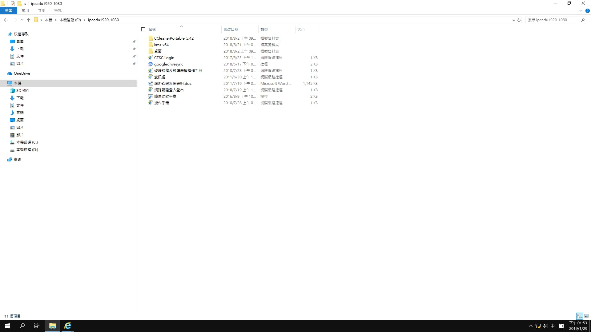
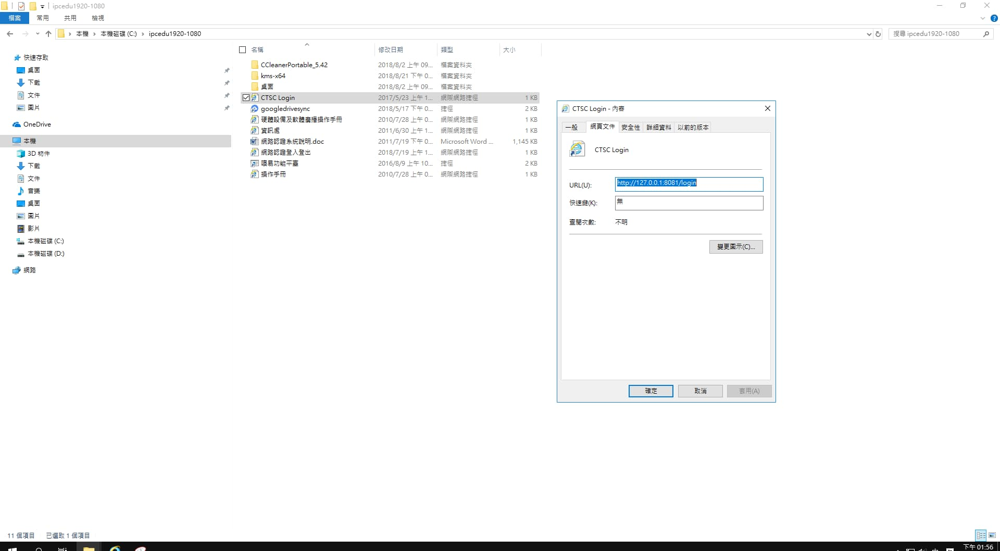
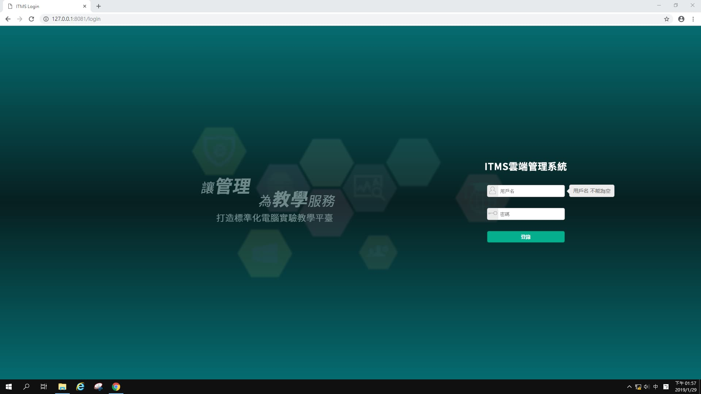
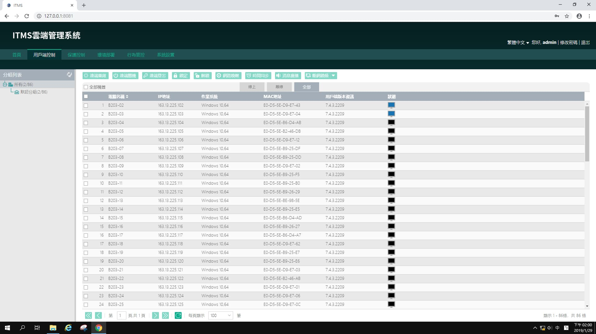
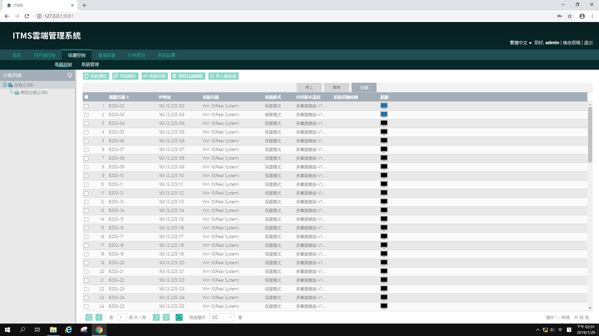
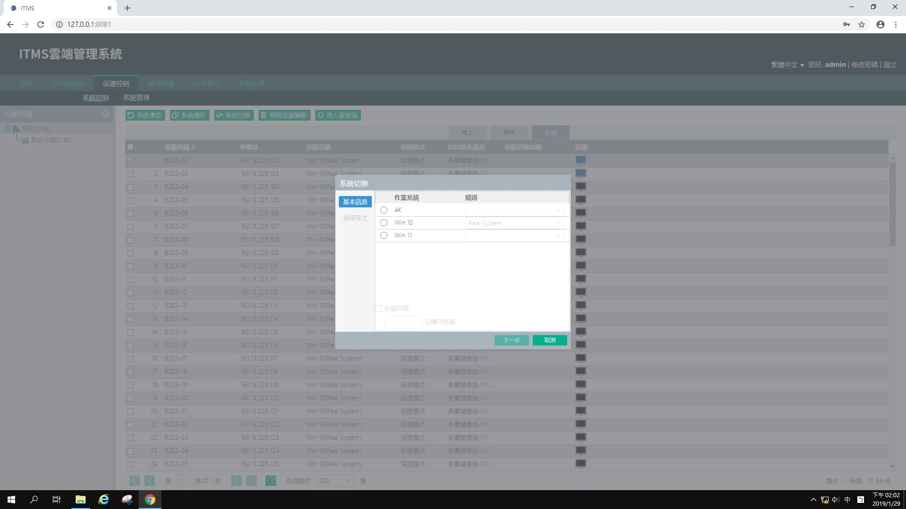
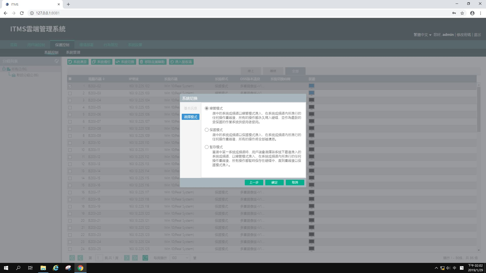
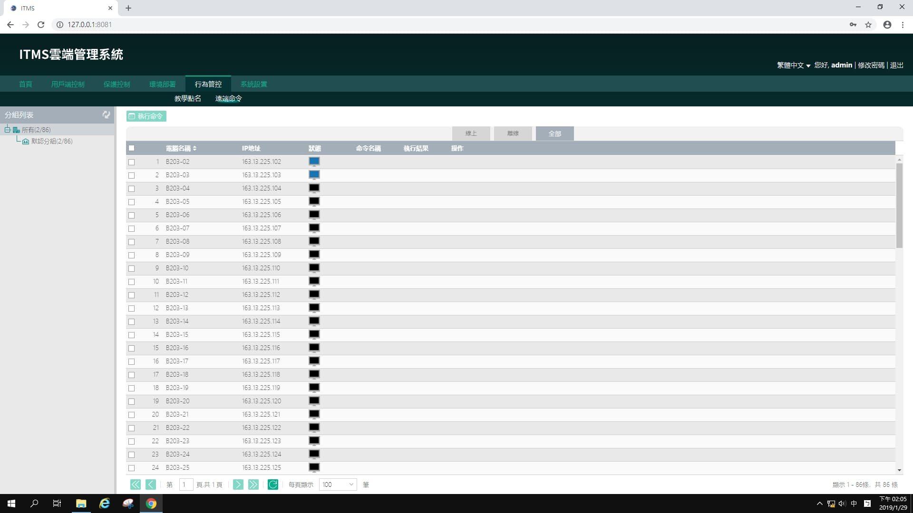
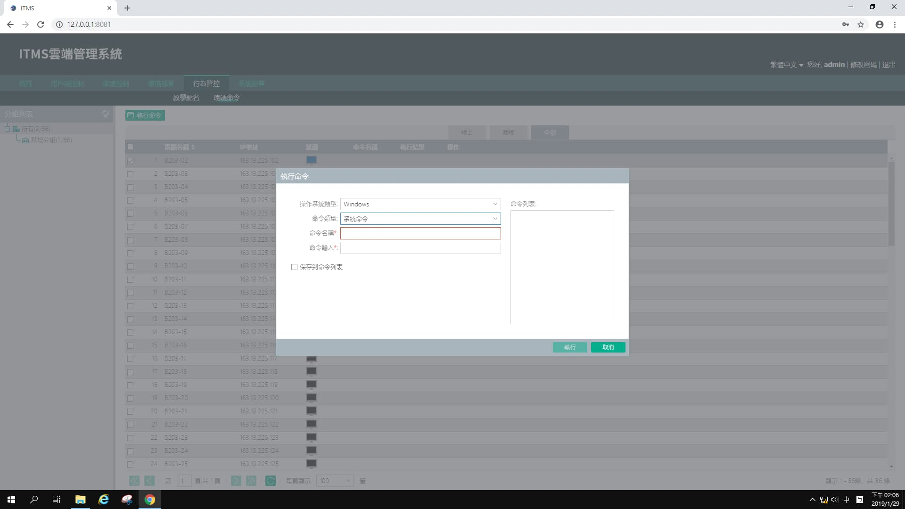

> 這篇主要介紹網頁版 CTSC，和舊版界面雷同。

## 注意事項

1. 這個程式只在 1 號機或者是老師機才有。
2. 要用 Chrome 開才能正常使用。

## 使用教學

### 如何登入

檔案位於 `C:/ipcedu1920-1080/` 裡面。

對著 CTSC Login 點擊右鍵 → 內容，會跳出一個新的視窗，CTSC 的網址。

將網址複製到 Chrome 內打開，會看到下面的畫面。

輸入帳號密碼後登入。

## 功能介紹

### 電腦控制

在這個用戶端控制畫面中，我們可以對所有已經開機的電腦，進行一些控制：

- **遠端重啟**：將所有電腦重新啟動。
- **遠端關機**：將所有電腦關機。
- **網路喚醒**：打開關機中的電腦。網路喚醒功能，必須要在總電源未關閉，而且當天那天電腦有開機過的情況下，才可以使用。

### 保護控制

在保護控制中，我們可以看到已經開機的電腦是處於總管模式或是保護模式。

### 保護切換

選取電腦後，選擇系統切換，會跳出下圖視窗。

選擇要切換的系統後，點選下一步會跳到下圖。

選擇要切換的模式後，按下確定，等待電腦重啟切換模式。

### 遠端命令

在行為管控頁面內，我們可以使用遠端命令，讓選取的電腦執行 Windows 內建的指令。

下圖是點選上方執行命令鈕，跳出的畫面。

- **命令類別**：看你是要執行指令，或者是打開文件或程式。
- **命令名稱**：隨意輸入你喜歡的名稱。
- **命令輸入**：可以執行 Windows 內建的指令。

