> 平常比較常遇到本機對拷，一般來說會拿隔壁電腦的硬碟來對拷。SSD 務必先用 RHD 清理硬碟後再進行對拷。

## 準備及注意事項

1. 確認新的或有問題的硬碟：SATA 線插的號碼大小不要大於正常的硬碟。例如正常的硬碟插在 1 號，有問題的就不能插在 0 號，因為程式是將硬碟號碼比較小的資料拷貝到號碼比較大的。
2. 硬碟型號是一樣的，不要把其他實習室的硬碟混在一起，除非有特別的指示。
3. 記得將電源線、SATA 線接好，硬碟電路板不要接觸到金屬部分，不然就墊個滑鼠墊在下面。

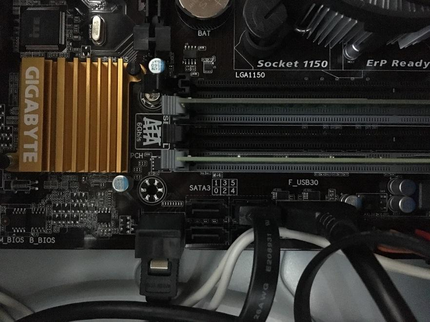

## 開始對拷

### 準備對拷

電腦重開機後，進到系統選單，這時候請按下 `F10`。

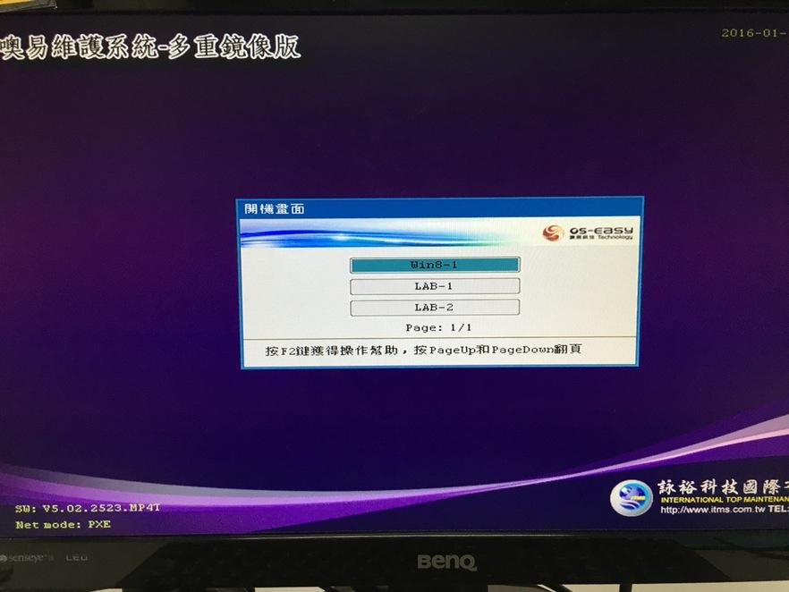

輸入帳號密碼。

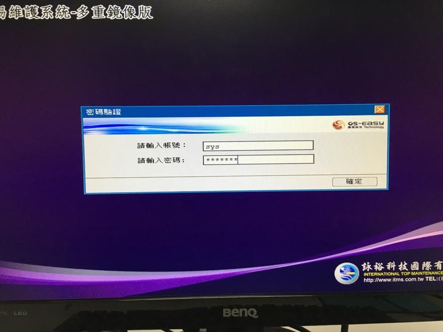

選擇差異拷貝。

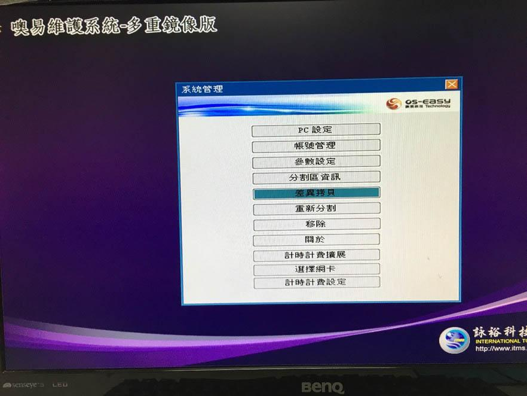

選擇傳送端。

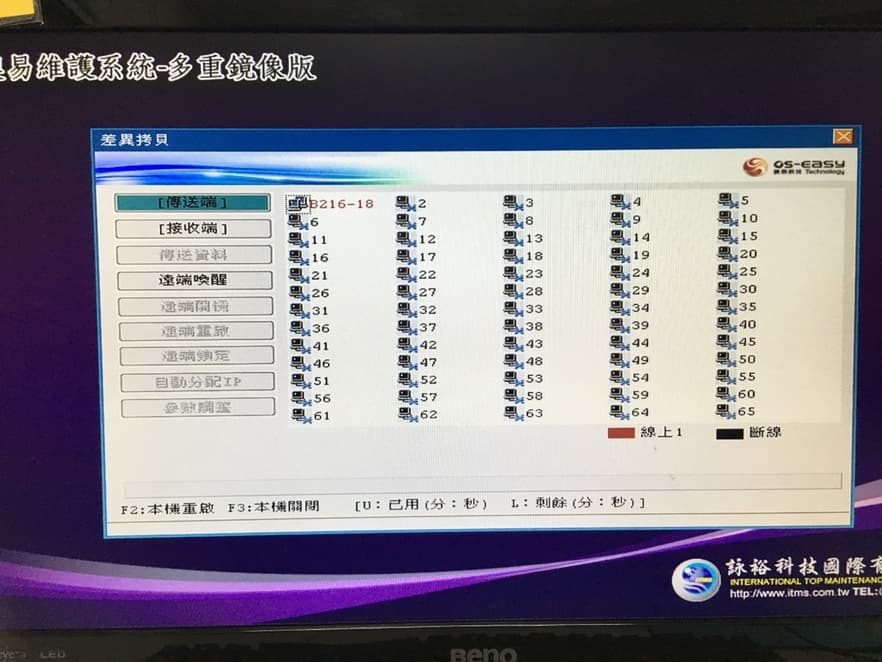

按完成登錄。

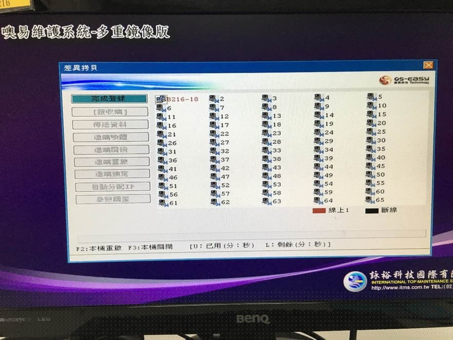

選擇傳送資料。

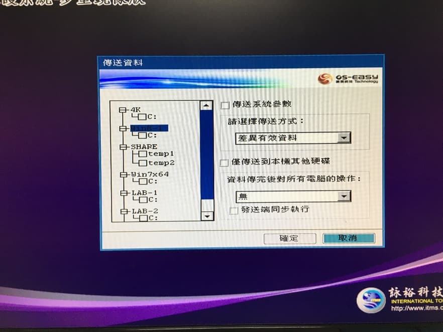

如果硬碟沒洗掉，只需要勾選壞掉的系統就好。如果硬碟洗掉，4K、SHARE 都要勾。剩下要傳哪些資料請務必先確認，按 `TAB` 鍵切換選項，`ENTER` 鍵勾選。

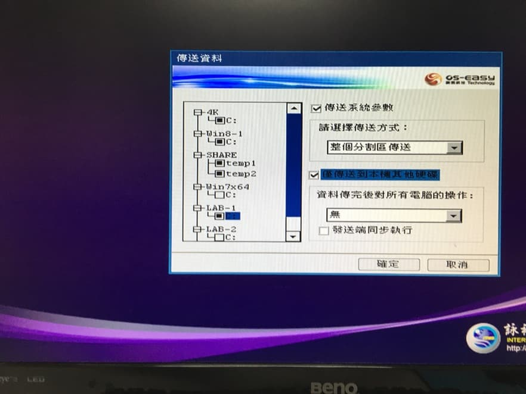

確認好傳送哪些資料後，選擇傳送系統參數、僅傳送到本機其他硬碟，對電腦的操作可以選擇「無」或是「重啟」，選完後按確定開始執行本機對拷。

一般來說傳送方式請選擇完整有效資料，如果硬碟洗過，才選擇整個分割區傳送。

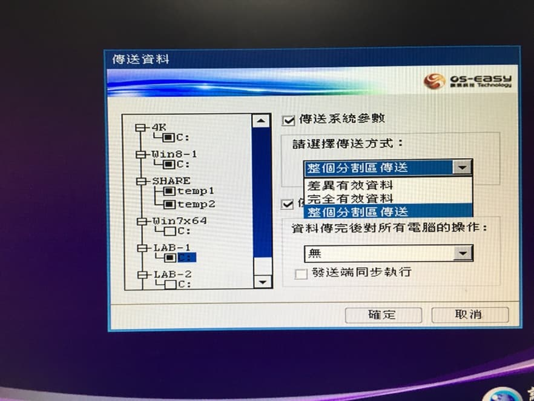

按確定繼續。

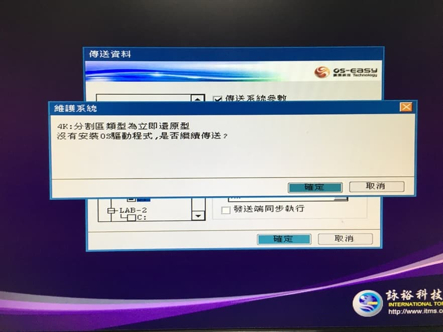

### 開始對拷

按確定，但如果硬碟數量顯示為 0，代表它沒有抓到硬碟，請先關機，確認線有沒有接好，或是可以進 BIOS 看看有沒有抓到硬碟。

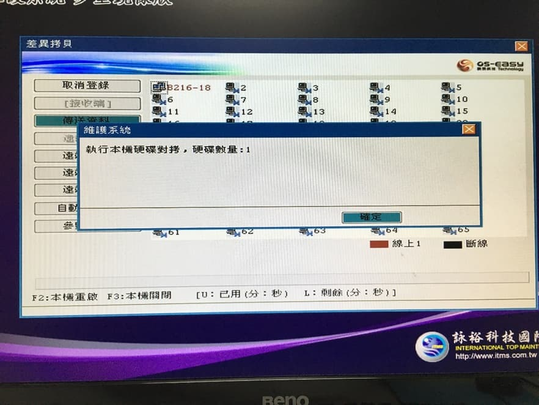

請先等它跑一陣子後，確認沒有卡死，速度也都是正常的，新版速度大約可以 10000 MB/min，如果是舊版大概只會有一半的速度，都沒問題後就可以放著讓它跑，大約 20–40 分鐘可以跑完。

速度有時可能會掉下來，是因為正在傳送細碎的檔案，這算正常現象。

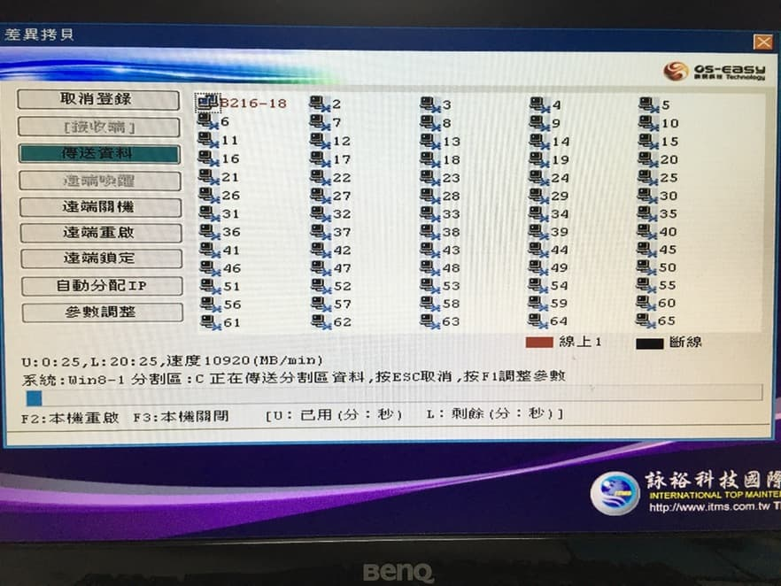

## 對拷完

### 修改電腦名稱

對拷完後請重新開機，將硬碟放回原本的電腦，主機後面的線接好，開機後看到系統選單時按 `F10`，進入到這畫面，請選擇 PC 設定，修改 IP。

這邊要修改的有電腦名稱和 IP 位置，電腦名稱皆為「實習室代號-電腦編號」。

IP 位址都有一定的規律，前三碼和預設閘道都是一樣的，最後一碼，請看隔壁的 IP 去推算，修改完之後按確認，並且按 `Ctrl + Alt + Del` 來重啟電腦。

如果你今天拿 19 號的電腦來對拷它 IP 是 `163.13.227.19`，那麼隔壁台 20 號的電腦 IP 就會是 `163.13.227.20`。

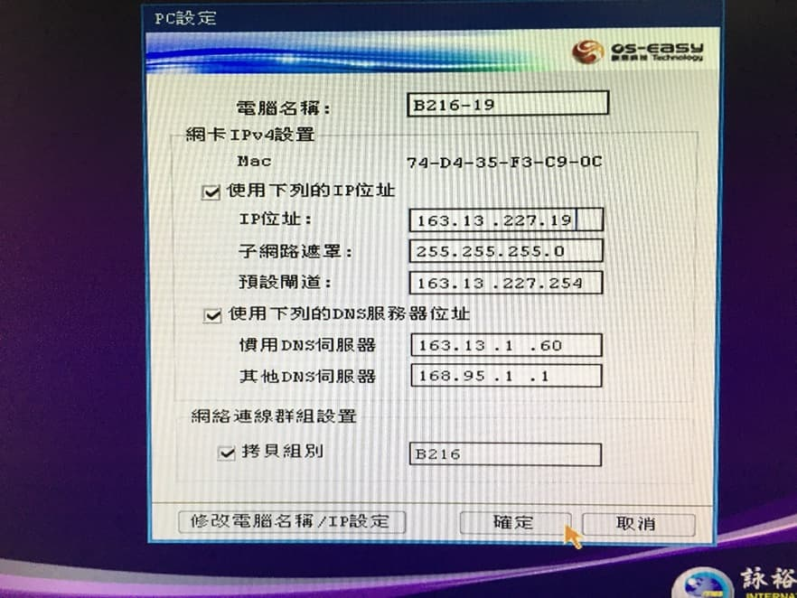

重開後，電腦會自己進入總管模式，會跳出下圖的視窗，改完會自己重開，請勿自己手動改設定。

假如你今天只有 Win7 一個系統，它修改完後就會自己回到 Win7 保護模式。但是如果今天有 Win7 + Win8 兩個系統，它會按照下列順序（進入 Win7 總管 → 自動改 IP → 重開機 → 進入 Win8 總管 → 自動改 IP → 重開機 → 回到 Win7 保護模式）。

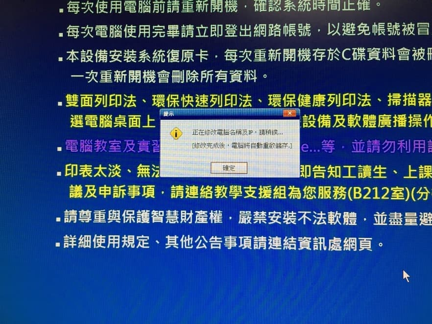

### KMS 認證

改完 IP 和電腦名稱後，記得要去做 KMS 認證（Windows + Office），如果有兩個系統，兩個都要做，記得先進總管模式，路徑如下圖，點進資料夾後，會有許多個檔案，看那作業系統是什麼點開對應的 bat 檔，Office 請注意那台電腦裝的版本及位元。

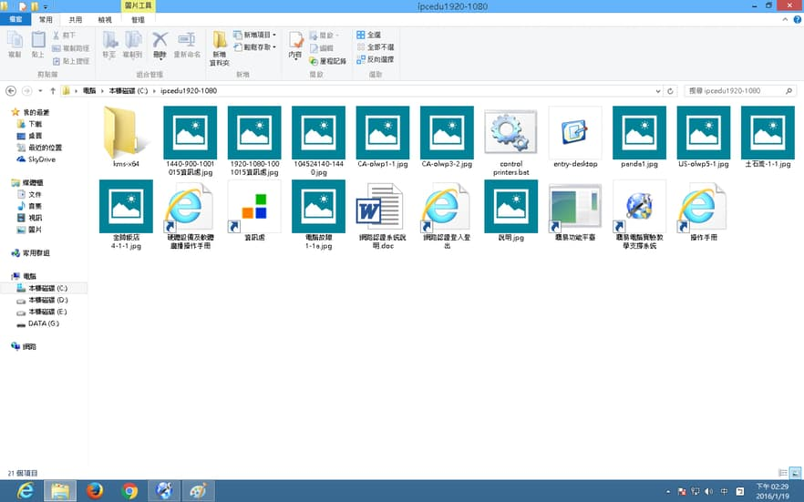

### 認證成功畫面

**Windows**

**Office**

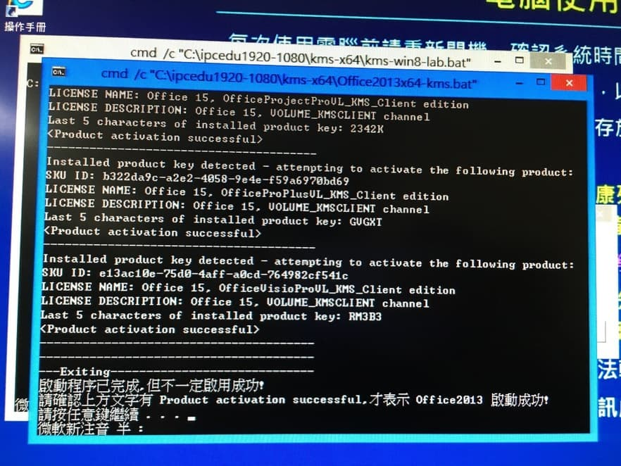

## 對拷結束

IP、電腦名稱修改完後，KMS 認證也做完後，請重新開機讓電腦回到保護模式，確認正常開機後，便可將電腦關掉，完成對拷工作。
