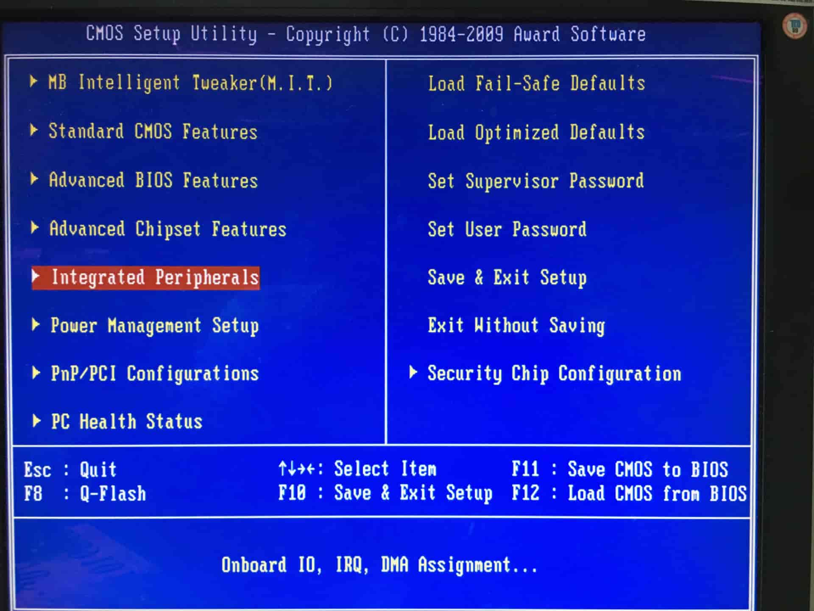
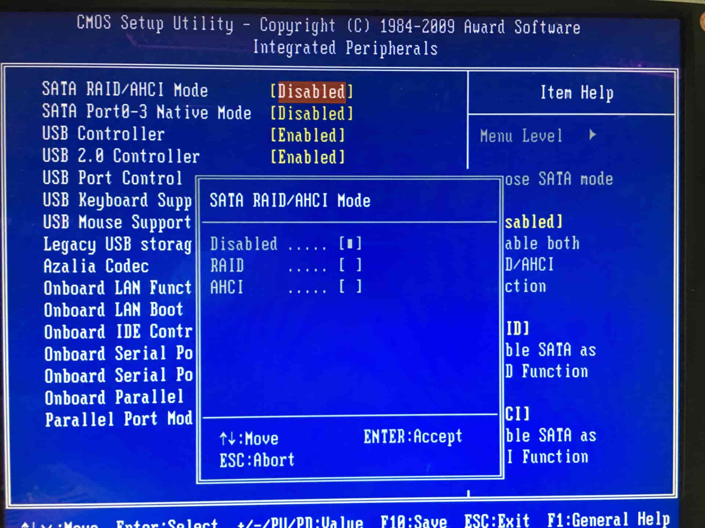
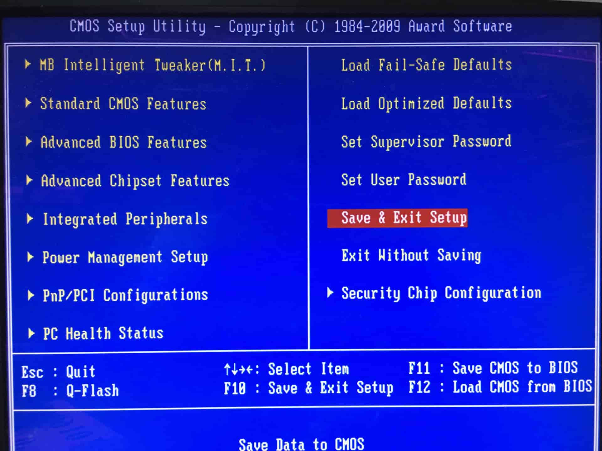
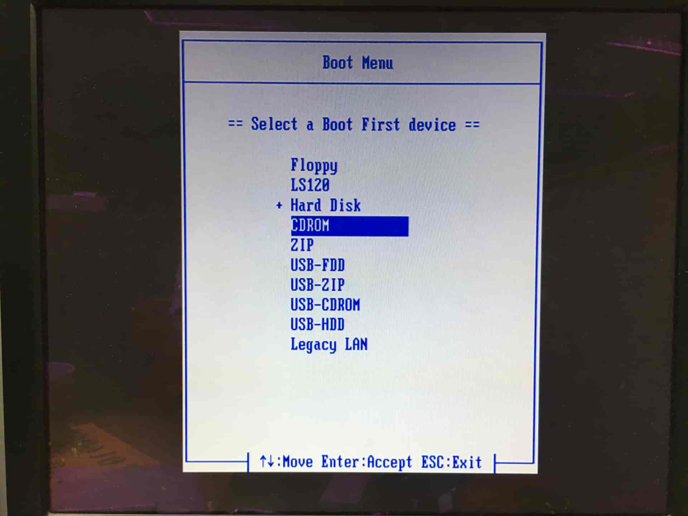
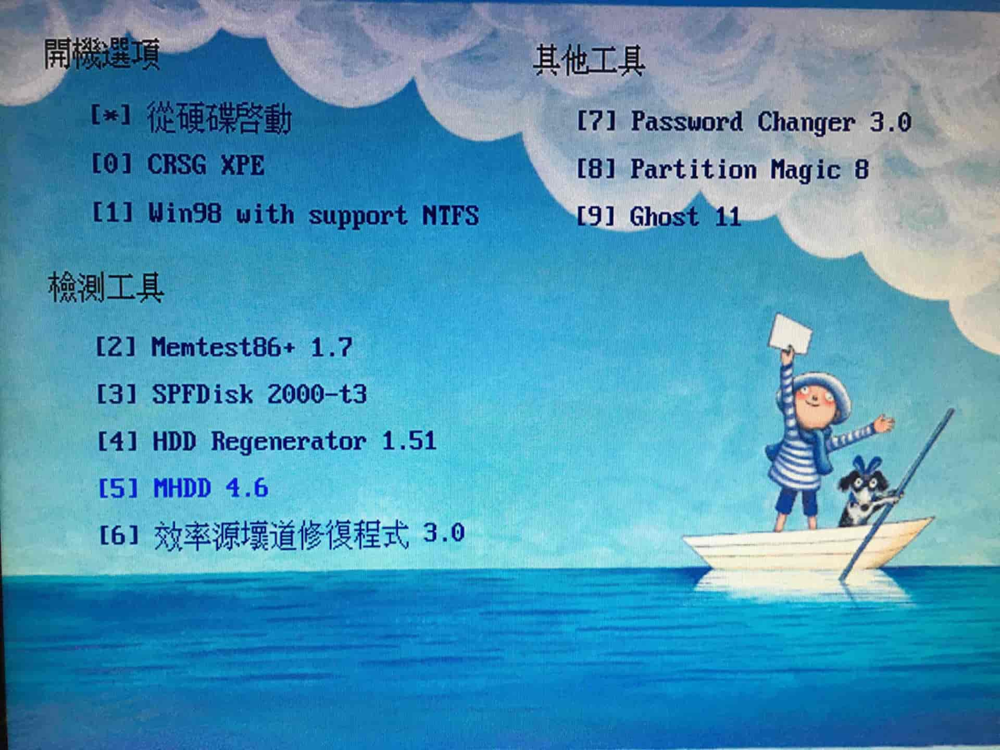
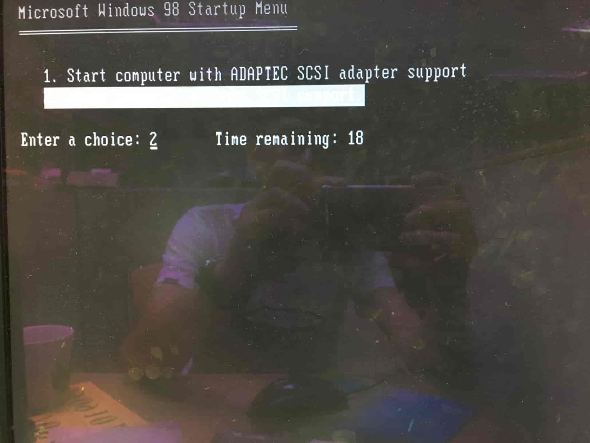
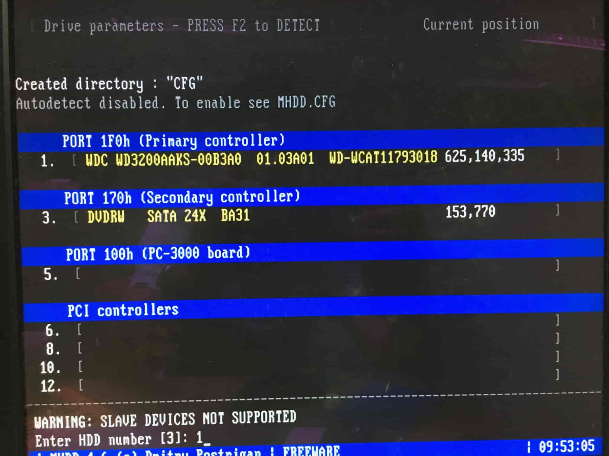
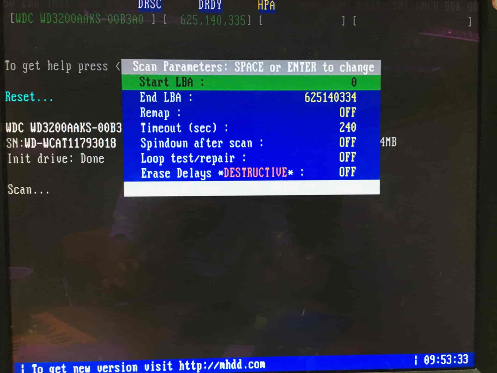
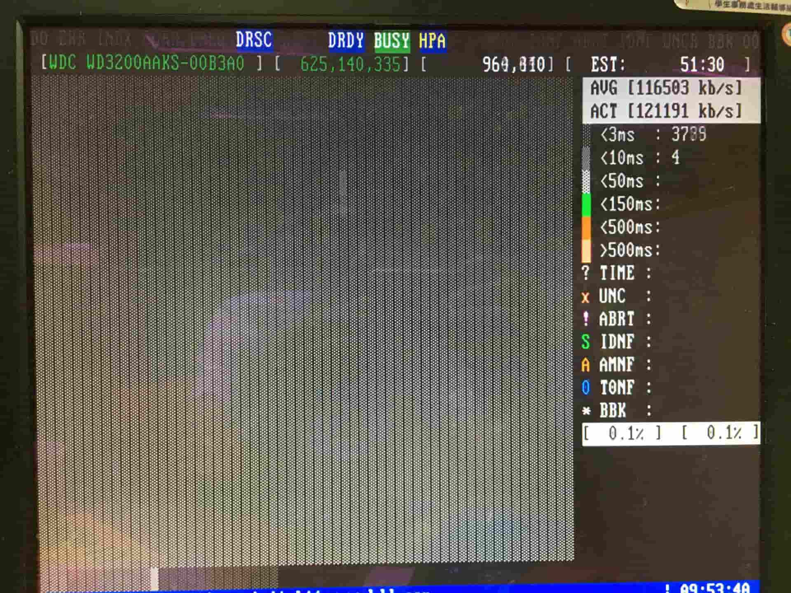

> 除了修改 BIOS 之外，還要記得拔還原卡。

## 修改 BIOS

先進 BIOS 檢查 SATA mode 是不是 IDE。如果是 AHCI，掃描程式會抓不到硬碟。

輸入密碼，進入 BIOS 後，依照圖片順序去檢查。

如果有修改設定，記得先儲存設定在重新開機。

## 硬碟掃描

重開機的時候，請按 `F12` 鍵進入 Boot Menu，選擇光碟 CD-ROM 開機。

之後會進到下圖的畫面，選擇 MHDD。

直接按 Enter 進入。

之後會看到裝置列表，硬碟在 1 號，輸入 1 之後按 Enter。如果沒看到硬碟，檢查 SATA mode 是否有改成 IDE，或是將 SATA 換插槽。

按下 F4 後會出現下列畫面，這邊設定維持預設值不做修改，再按一次 F4。

這邊要注意掃描結果，是否有出現 ERROR 或是 `> 500ms` 的區塊過多，這樣代表硬碟可能有問題。

