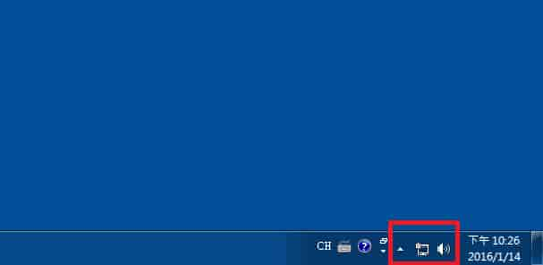

電腦無法開機有很多種狀況，首先要檢查電源有沒有插好，不要一開始就先急著拆主機。另外主機在正常狀態下，會有「逼」一聲，才會進入開機程序。可以將 RAM、保護卡都拆下來清理，再檢查一次 BIOS 設定無誤，通常可以解決。

## 無法開機

1. 假如沒有出現「逼」一聲，有一部分常見的問題是 RAM，可以把 RAM 拔起來清潔後，再重插回去，接著不要鎖回機殼，直接插上電源測試能不能正常開啟。
2. 還有一種狀況是開機後有「逼」一聲，但是開機過後不久螢幕出現很多彩色小方格，這種狀況是 BIOS 壞掉，重刷完 BIOS 後就可以正常開機了，記得刷完 BIOS 要重新設定 BIOS 內容。
3. 開機過畫面顯示 `not found` 或是 `read disk failed`，這比較偏向是硬碟的問題。
4. 還有另外一種狀況就是 USB 延長線或是讀卡機短路，可以稍微檢查一下接頭的部分，如果內部的針有歪斜或者斷掉，請通知劉大哥！

## 螢幕

1. 螢幕全黑、顏色跑掉、看起來模糊不清，先看看螢幕線是否有接好。
2. 電源鈕按了一直沒反應，可以先看一下電源線是否有接好。
3. 上述都沒有用的話可以先和隔壁台螢幕做交叉測試，看看是哪一邊的問題。

## 鍵盤 & 滑鼠

1. 假如某個鍵按了沒有反應，先試試看重新插拔看會不會正常。
2. 重新插拔後還是無法正常使用，可以先試試看插其他的孔。
3. 都還是有問題，就換備品。

## 耳機

耳機如果沒有聲音，請先確認電腦的音效有沒有打開！如果音效有打開，正常撥放情況下還是沒有聲音，請用隔壁的耳機做交叉測試。

再不行！就直接換新的。

## 網路

首先，可以先看看右下角的網路圖示。

以 win7 為例：

如果顯示驚嘆號，請先確認是否有登入流控牆，假如有的話可以檢查一下 IP 設定是否有跑掉，網路線有沒有鬆脫。

如果顯示為叉叉，檢查主機後面網路孔燈號是否有在閃爍，檢查網路線是否有鬆脫，將地板上以及主機板的網路插孔重新插拔過後，測試看看是否正常。

假如還是不行的話，就要再做進一步的測試，測試如下：

1. 主機板的網路孔出了問題。
2. 地板上的網路孔出了問題。
3. Switch 端的網路孔有問題：可以先看看 Switch 燈號是否有閃爍。要先看看那條線的編號是多少再去 Switch 端查看，網路線上通常都會有黃色圓環標示他的編號。
4. 網路線故障。

## 交叉測試

> 簡單來說，就是拿正常的零件和可能有問題的去互相交換做測試。

這邊以網路為例，其他零件也可以用同樣的方法測試：

- 假如你今天是主機板後面的孔故障了，你把這台主機的網路線接到另外一台主機，發現說另外一台主機可以正常上網，就可以得知說是主機板網路孔故障。
- 假如是 Switch 端或地板上網路孔故障，可以將網路線插到另外一個孔測試。
- 如果網路線壞掉，可以拿一條正常的網路線去測試。
