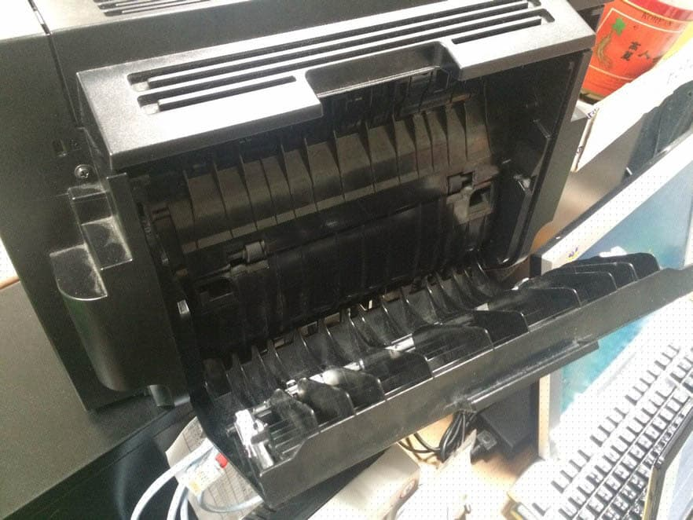
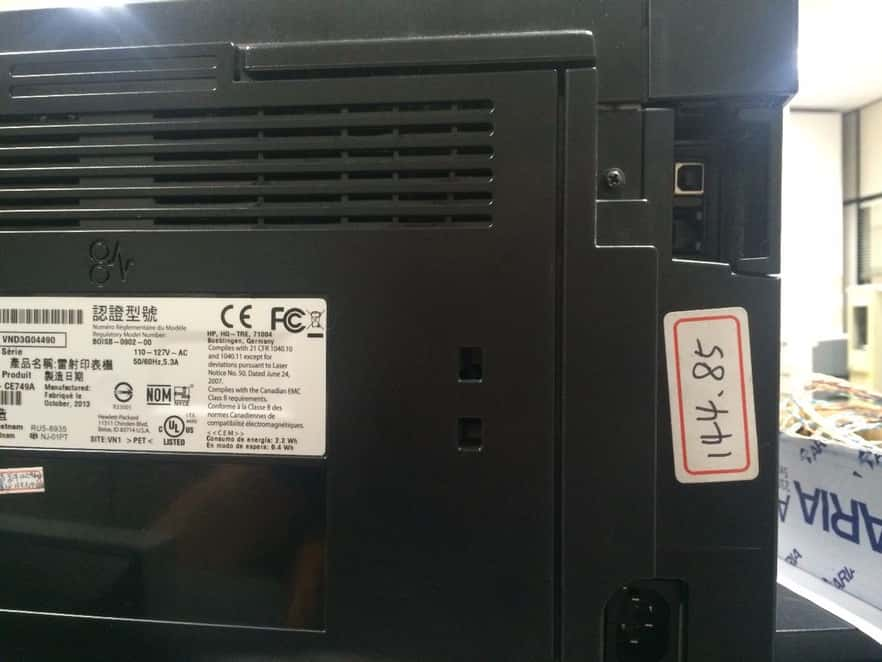
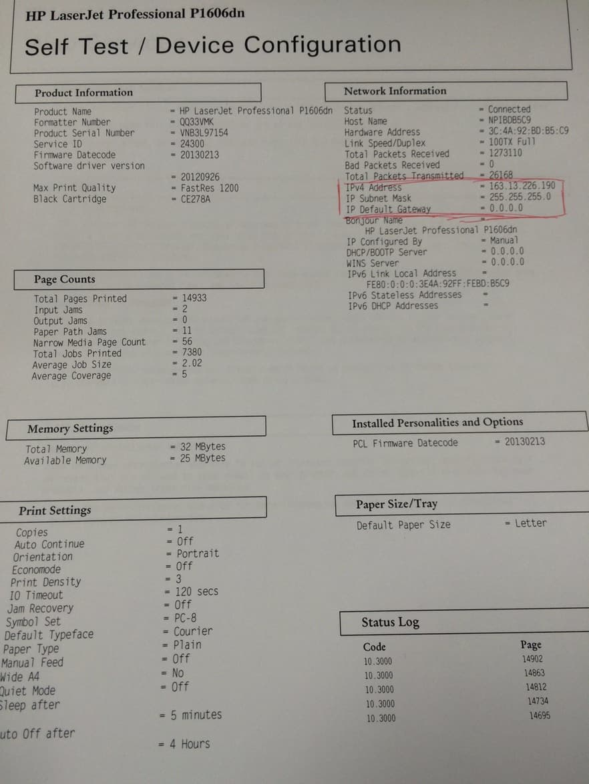

> 以下列出比較常見的處理狀況，另外印表機維修時間請不要超過兩小時。

## 印表機卡紙

卡紙的位置有出現在背版、吸紙處、吐紙處及轉輪內部。

### 背板

直接打開背板取出（開啟背板角度請勿過大，背版會斷裂）。

### 吸紙處

直接取出。

### 吐紙處

通常卡在這裡會咬得很緊，打開印表機取出碳粉匣從內部用手取紙比較妥當。但如果打開印表機發現內部看不見卡住的紙張，就代表紙張是卡在轉輪內部。

### 轉輪內部

通常卡在這裡會咬得很緊且無法用手順利取出卡紙，此種情形請勿用手粗魯的取紙，因為可能會導致紙張碎在機器裡頭更難處理。

先打開印表機的上殼後，可以發現吐紙處中間下緣有綠色卡榫，壓下去後可以將吐紙處的外殼再往下掀開。

從劉大哥左側桌子上可以取用尖嘴鉗，利用尖嘴鉗慢慢的將紙一點一點從掀開後的吐紙處平行拉出，只要不施力過當導致紙張破裂，就可以慢慢的將紙張拉出來。

若紙張無法順利取出卡在轉輪內部，可直接送往 B219 維修隊處理，事件申請系統上需要開單且轉單，接著維修隊會交換一台備品回來，把備品改成原本故障品的同 IP 後即可正常上線，轉單的方式請查看[事件申請系統](/system)。

## 電腦無法連線至印表機

1. 先檢查該台印表機電源是否為開啟狀態。
2. 如果印表機電源是開啟的，可以先列印「印表機狀態頁」，方法是按著印表機上的「繼續列印」鍵，大約五秒就會列印出來。會印出兩頁，但只有第一頁有用，所以在第一頁印一半的時候，就可以按取消列印。
3. 印完後可以檢查一下圖中紅框處的 IPv4 Address 是不是和印表機本身的 IP 相同（有一張標籤），如果不同就要去修改印表機 IP，改成正確的。

## IP 錯誤

有時候印表機狀態頁顯示出來的 IP 可能顯示成 `0.0.0.0`，或是因為某些原因，導致印表機 IP 跑掉，這時候我們就要去把印表機的 IP 修改成原本正確，詳細步驟請看[耗材更換](/printer)。

## 印表不良（有黑邊、汙漬）

列印測試頁並保留結果，然後開單並轉單至維修隊處理，列印的測試頁同印表機一起送去維修隊後，交換一台備品回來，把備品改成原本故障品的同 IP 後即可正常上線。

改 IP 的方法請查看[耗材更換](/printer)；轉單的方式請查看[事件申請系統](/system)。

## 內部有橘黃色粉末或碎塊

此為印表機內部零件損毀，處理方式同上。
