> 在做完更新後，有時間的話會做網路對拷，將更新套用到其他電腦上。

## 準備及注意事項

1. 做網路對拷之前，先將機櫃內 Switch 的對外網路線拔掉，對拷完再接回。對外網路線：機櫃上編號為 `B2XX-A` 的網路線，例 `B201-A`。
2. 網路對拷要在保護模式下才能運作。
3. 做網路對拷之前請確認有哪幾個分區要對拷。
4. 現在有些比較新的系統，在做完對拷之後，他會自己認證，但重開機之前要先跳線並將對外網路線接回去。

## 開始對拷

### 準備對拷

通常會選擇 2 號來做對拷，電腦開機後，點開右下角的狀態列，會發現有一個叫噢易維護系統的程式。

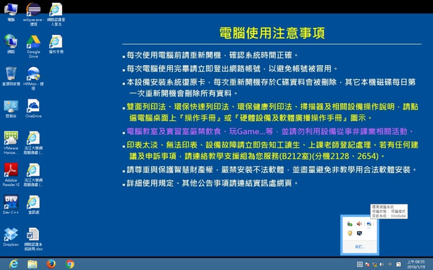

滑鼠點兩下後，會跳出一個新的視窗，可以看到現在的保護狀態。點開噢易功能平台。Win8 點了之後，程式會消失再出現，再重新點一次之後，視窗就會跑出來了。

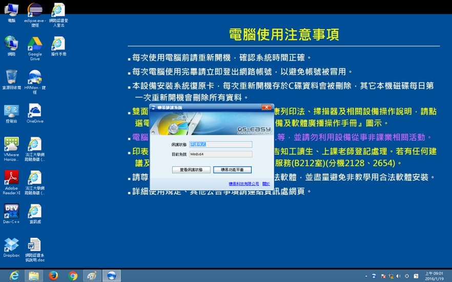

成功進入後，點選差異更新，並輸入帳號、密碼。

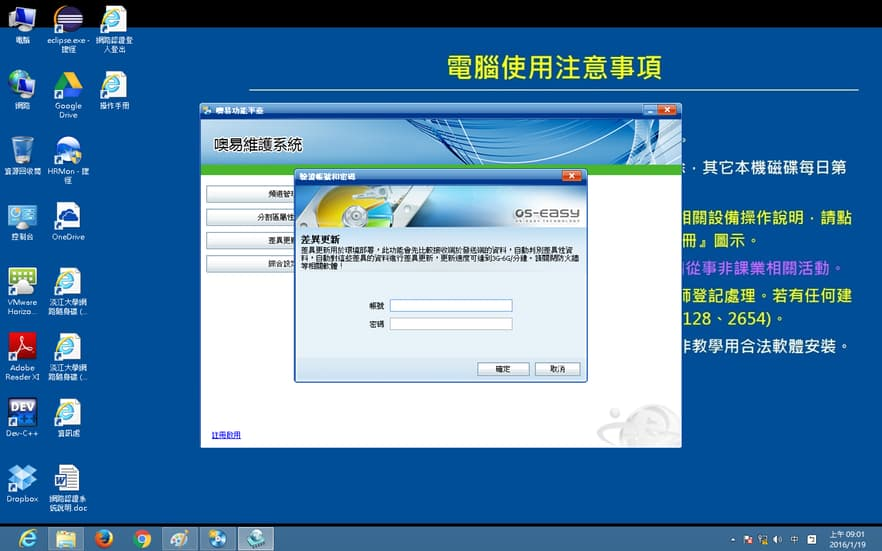

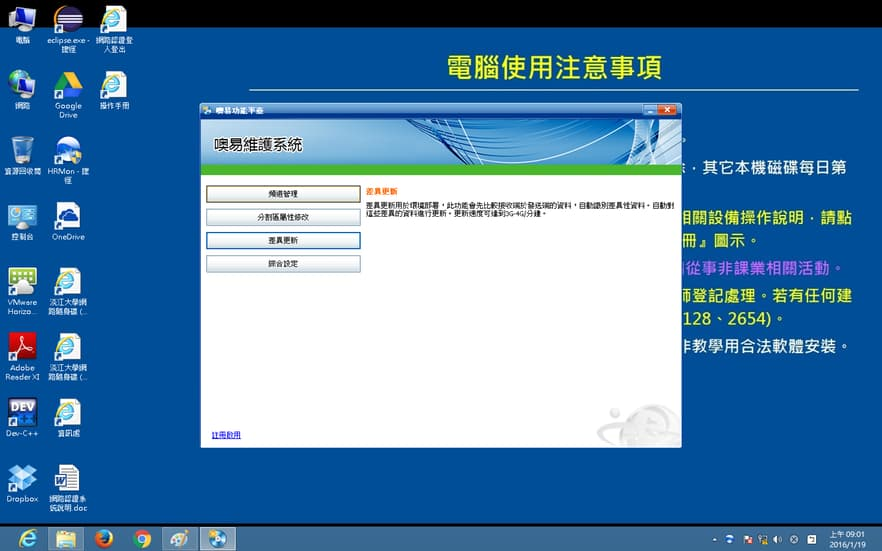

先去看看參數設定裡面是否是 Linux 文字模式。在選擇等待登錄，並且將其他要對拷的電腦一一開機。

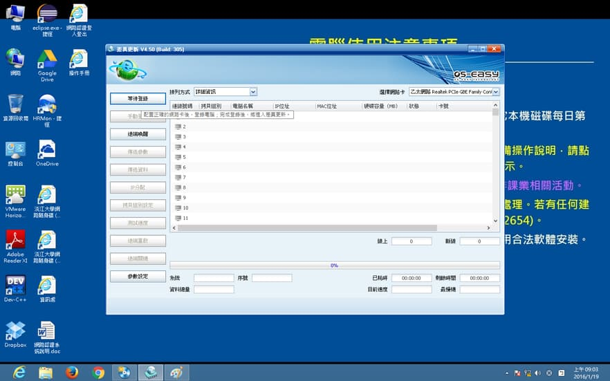

有連上的電腦都會顯示在這裡面，像圖中 14 號就沒有成功連線。如果沒有連上的話可以先重新插拔網路線，看看是否為線路問題，如果線路沒問題可以將還原卡拔起來清潔。

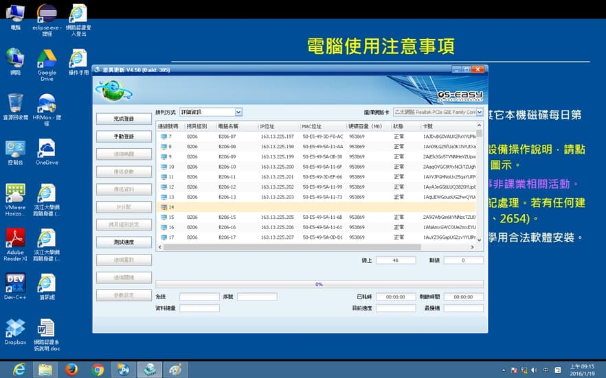

其他電腦會出現圖片中的畫面，每一條資訊都有顯示出來，才算有成功連上。

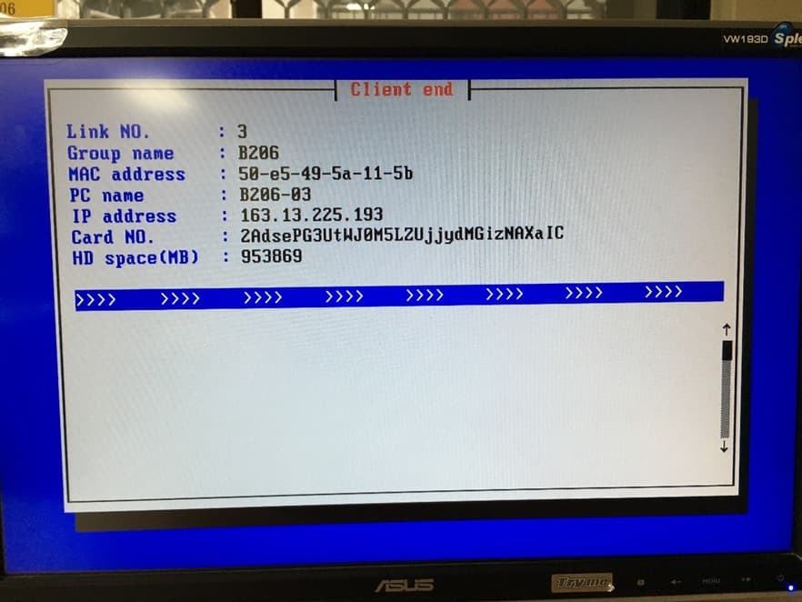

確認電腦都有連上後，按完成登錄，會跳到這個畫面，準備開始對拷。

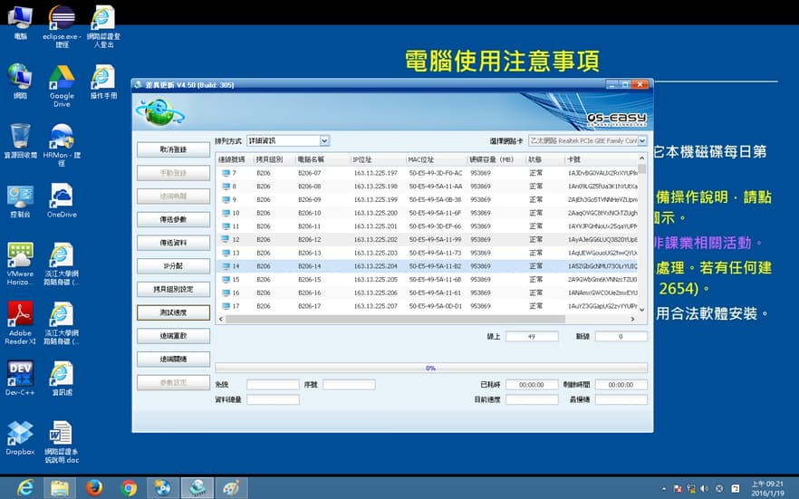

### 開始對拷

對拷前先點選左邊的測試速度，選擇封包測試，有些比較舊的版本只有 PING 測試，如果是舊版就可以不用測了，正常速度應該為 2、3000 MB/min ~ 5000 MB/min 左右。

要注意最慢機是否一直是同一台電腦，如果一直都是同一台，通常將主機後網路線和地板網路接口都重新插拔後就會正常了。

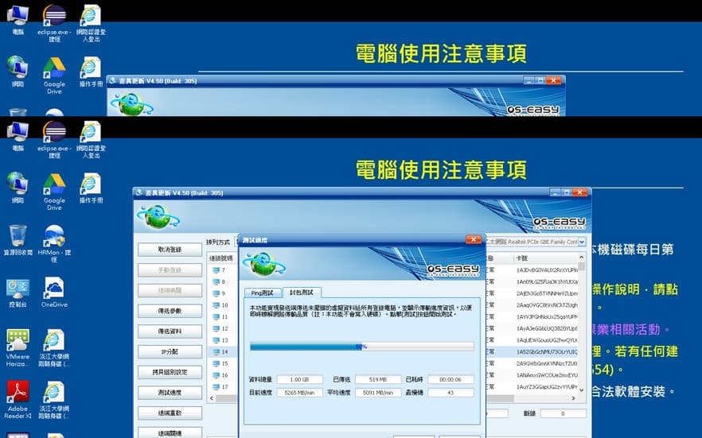

這裡要傳送哪些資料，請務必確認過再開始傳送，傳送方式正常會選擇完整有效資料，下面對電腦的操作選擇無，不用勾發送端同步執行，確認無誤後，按確定開始對拷。

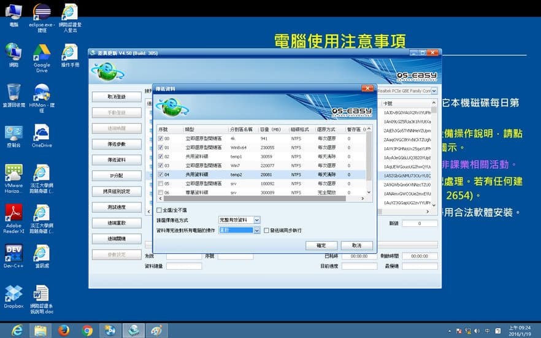

和本機對拷一樣，先等資料成功傳一陣子之後，確認資料有開始在傳、速度沒有問題、最慢機不是一直固定停留在同一台後，便可以放著讓它自己跑完。

## 對拷完

當對拷結束後，每台電腦都會自己去改電腦名稱和 IP，更改完後每台電腦都會回到保護模式。

### KMS 認證

這時便可以利用 1 號電腦去控制其他電腦，利用噢易電腦實驗教學支撐系統（CTSC），程式位置如下，點開後輸入帳號、密碼。

選擇全部電腦後，2 號不用選，選左邊的系統切換，將每台電腦切到總管模式，有對拷到的系統都要重新做過一次 KMS 認證、改預設印表機。

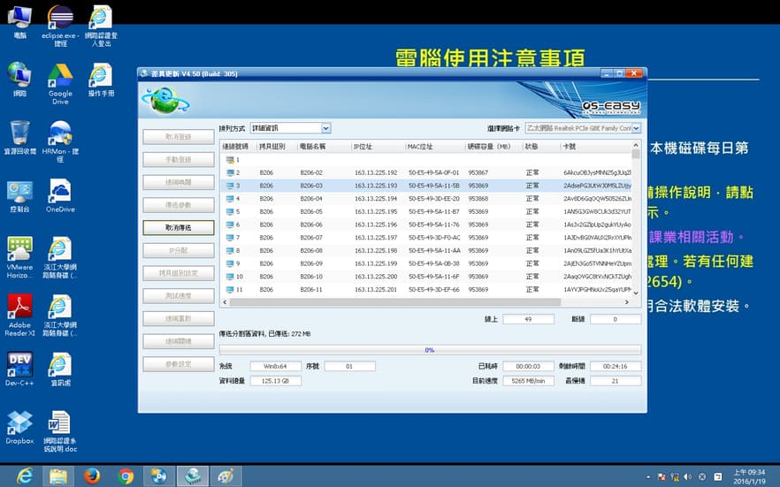

其他電腦重新開機後，點開右下角的噢易保護系統程式，看看保護狀態是否寫總管模式。

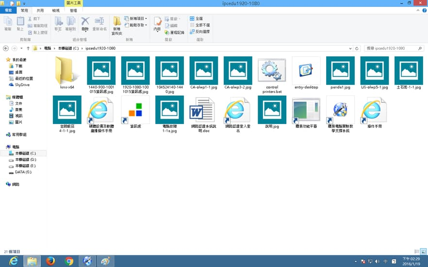

更快的方法是利用噢易電腦實驗教學支撐系統（CTSC），如果畫面中作業系統 `real system` 字樣消失的話（見下圖），就代表這台電腦有進到總管。

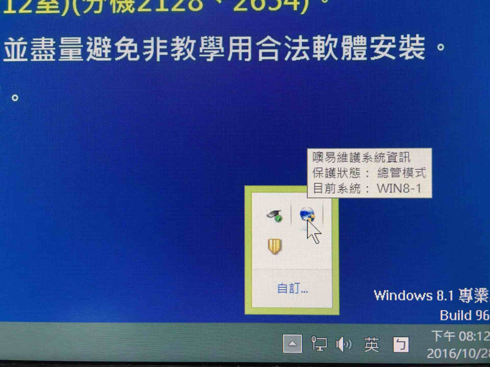

確認每台電腦都有進入到總管後，便可以開始做 KMS 認證，認證檔都放在 `C:/ipcedu1920-1080/kms` 裡面。

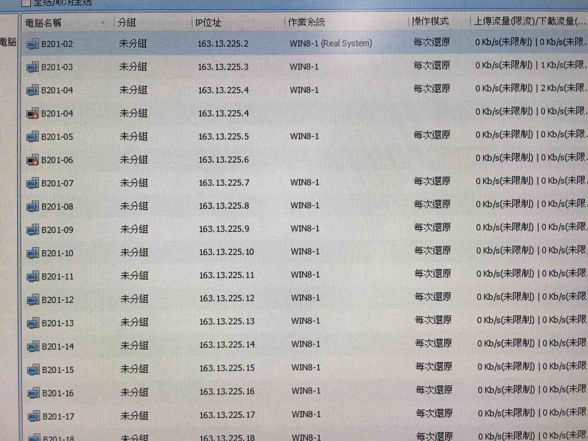

- 有些資料夾名字可能後面會多個 `1920-1080` 變成 `ipcedu1920-1080`，裡面東西都一樣，認證有 Windows 和 Office 兩種。
- 一次不要選全部電腦一起做，可以先選 20、30 台或是整間的一半去做，做完一部分，再接下去做剩下的電腦。
- 認證失敗的原因：
    1. 沒接到網路。
    2. 電腦時間日期不對。
    3. BIOS 版本不同。

認證跑完後要一台一台檢查認證是否有成功。

### 認證成功畫面

**Windows**

**Office**

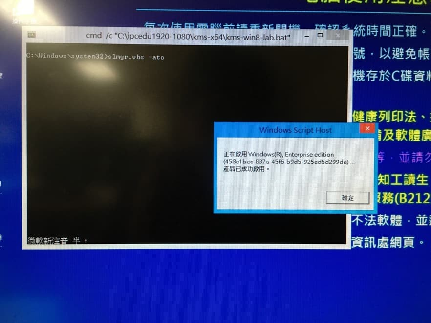

### 修改預設印表機

打開控制台，選裝置和印表機，進去後會看到很多台印表機，看看那台電腦所屬那排印表機是哪一台，對著那台印表機點右鍵，設定成預設印表機就可以了。

## 對拷結束

KMS 認證、預設印表機都確認修改完後，將每台電腦利用噢易電腦實驗教學支撐系統（CTSC）的遠端重啟功能，讓每台電腦重開並回到保護模式。

確認電腦都正常後，再用遠端關機功能，關閉每台電腦。
