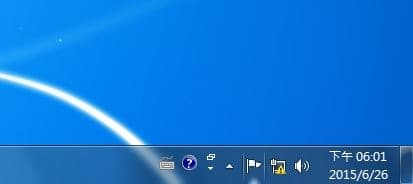
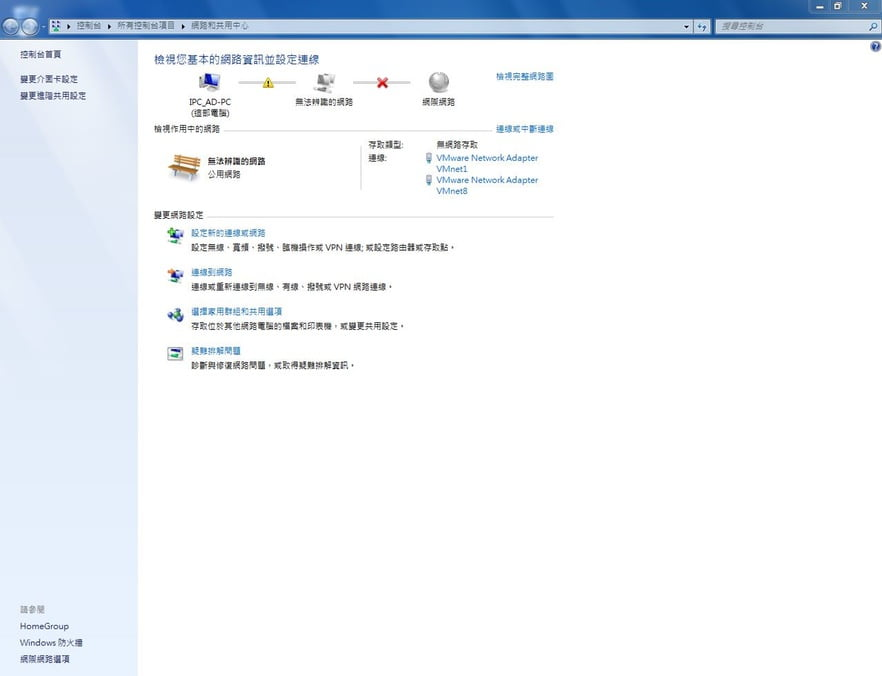
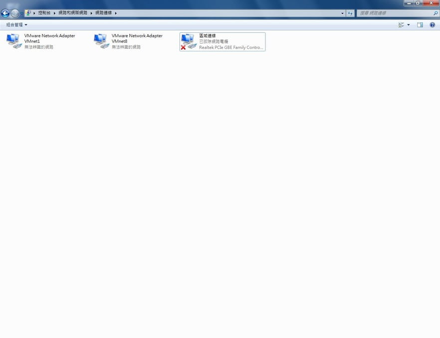
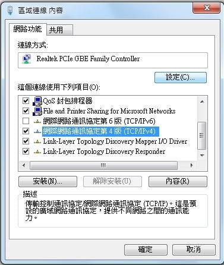
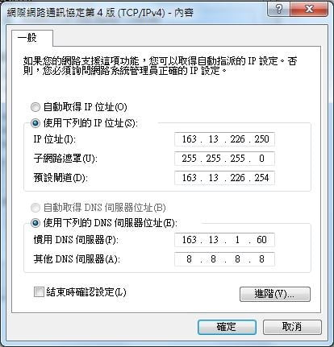
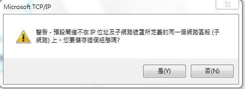
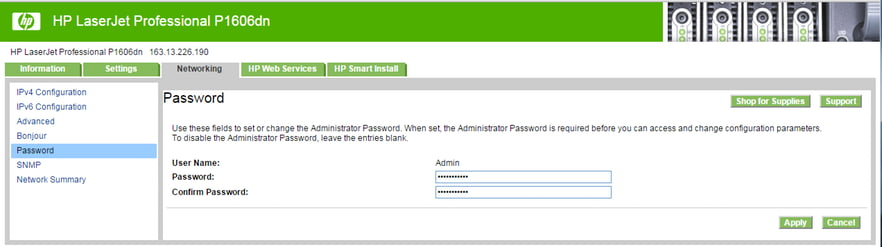
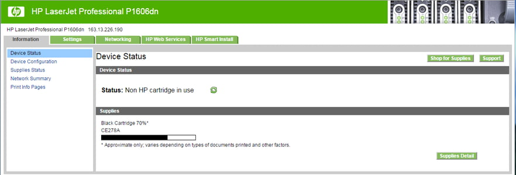
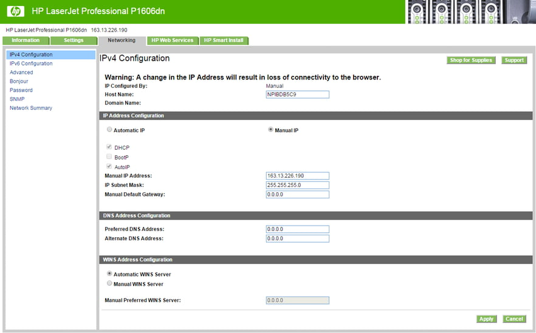
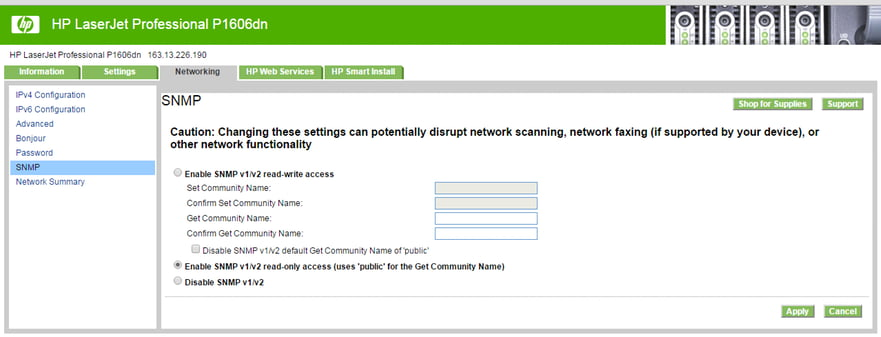

## 注意事項

> 修改 IP 請直接拿回 B212 修改。

1. 先接上電源（電源線是放在工讀生座位，貼著螢光綠的貼紙）。
2. 拿座位前方的一條藍色網路線，從印表機後面的網路孔插上，接上其中一台電腦主機的網路孔。

網路互接，是為了讓電腦和印表機形成區域網路。

## 修改 IP

1. 成功連接後，滑鼠移到右下角，對著顯示驚嘆號的電腦點右鍵，選擇開啟網路和共用中心。

   

2. 選擇左邊的變更介面卡設定。

   

3. 對著區域連線點選右鍵 → 內容。

   

4. 會看到 TCP/IPv4，點選內容。

   

5. 這時候要注意一下，除了 IP 位址，其他地方都不用做修改。

   假如印表機狀態頁上顯示出來的 IP 是 `163.13.226.85`，這邊就要設定 `163.13.226.xxx`。通常 `xxx` 我們會保留原本那台電腦的數值；前三個區段相同就好（指的是 `163.13.226`）。

   

6. 改好後按確定，看到下列訊息點是。

   

7. 開啟瀏覽器，在網址列輸入你在印表機狀態頁看到的 IP 位址。

8. 此時會要你輸入密碼，輸入完後就可以順利進到印表機設定畫面。假如沒跳出要輸入密碼，一定要先到 Networking 頁面底下，Password 那邊做修改（修改畫面如下圖）。

   

   以下這幾種狀況可能會需要重設印表機設定：

   - 上一個工讀生把密碼設錯了。
   - IP 衝突。
   - 印表機開機過很久，IP 顯示為 `0.0.0.0`。
   - 在最後設定的時候有某個地方設錯了，例：IP 某一個沒打，是空白的。

   **重設方法**：關掉印表機電源後，按著上方兩個按鍵不放，再把電源打開，此時三個燈號會一起閃爍，閃了五、六次就可以放開，完成重設動作。

   印表機設定畫面：

   

9. 輸入完密碼或是密碼設定後，就可以進到 Networking 頁面底下選擇 IPv4 Configuration 這邊去修改 IP，選擇 Manual IP 手動設定。

   

    - **Manual IP Address** 這邊改為 `163.13.xxx.xxx`（`xxx` 部分要看該台印表機後面的標籤是寫什麼去做修改，每台印表機都不一樣）。
    - **IP Subnet Mask** 每間都是固定為 `255.255.255.0`。
    - **Manual Default Gateway** 改成 `0.0.0.0`。

   改完 IP 後，點選左邊的 SNMP，選擇 `Enable SNMP v1/v2 read-only access...`（跟圖中的選項相同）。

   

10. 送回實習室前，務必印一張測試頁，確認設定無誤。
