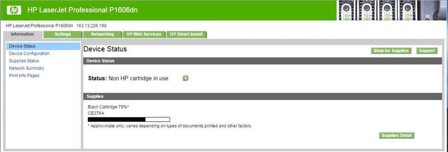
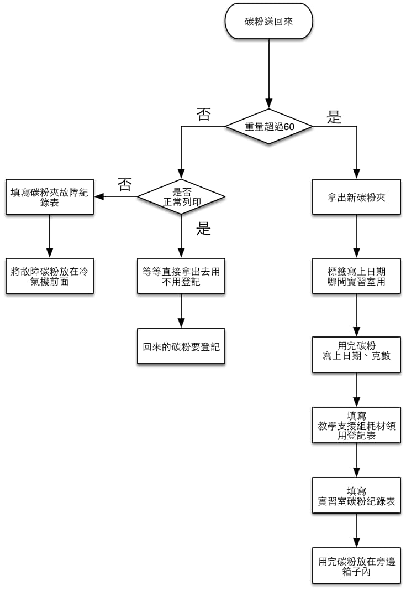

## 正常碳粉

從倉庫配送紙和碳粉匣進入 B212 辦公室時，請填寫「教學支援組耗材庫存登記表」的領用量。

從辦公室配送白紙和碳粉匣時，請填寫「教學支援組耗材領用登記表」上對應時間和哪一間的表格內，以正字紀錄數量。

假如上一班有留下可以繼續使用的碳粉，出去時不用紀錄，但是回來還是要記錄。

從各實習室送回使用完畢之碳粉匣時須記錄於「實習室碳粉夾紀錄表」，依照表格格式填入碳粉匣的使用資訊。

## 故障碳粉

先把故障碳粉放印表機內，並且到印表機設定頁面，查看碳份剩餘容量。

例：`B203-L2 (?)`，代表是 B203-L2 碳粉匣故障，剩餘容量顯示為 `?`。

1. 碳粉送回來時，先確認碳粉匣的使用重量是否達到標準，目前使用 HP 1606 ＆ M201dw 碳粉匣的狀況至少可使用 60 至 90 克。
2. 若沒有達到標準，請確認該碳粉匣是否真的已經無法列印出清楚的黑色而非誤報。
3. 可繼續列印的碳粉匣請退回至實習室繼續使用。
4. 若無法列印出清楚的黑色則另外處理該碳粉匣，將該碳粉匣放置在冷氣前的紙箱內並填寫碳粉匣故障紀錄表，故障原因填寫「過淡」。
5. 碳粉匣有其他故障如碳粉匣解體、碳粉漏出等等，先以裝碳粉匣的黑色塑膠套裝入，外頭再以白紙包住並在寫上該碳粉匣的故障狀況，登記碳粉匣故障紀錄表後放入箱內。
6. 另外將故障碳粉放入箱內時，將過淡以及非過淡碳粉分成兩箱來放。
7. 當箱子內的故障碳粉登記數量達到 35 隻時，請將碳粉夾依照空匣的整理方式來排放，並將箱子內的手寫登記表，打成電子檔。

## 碳粉夾更換流程圖

