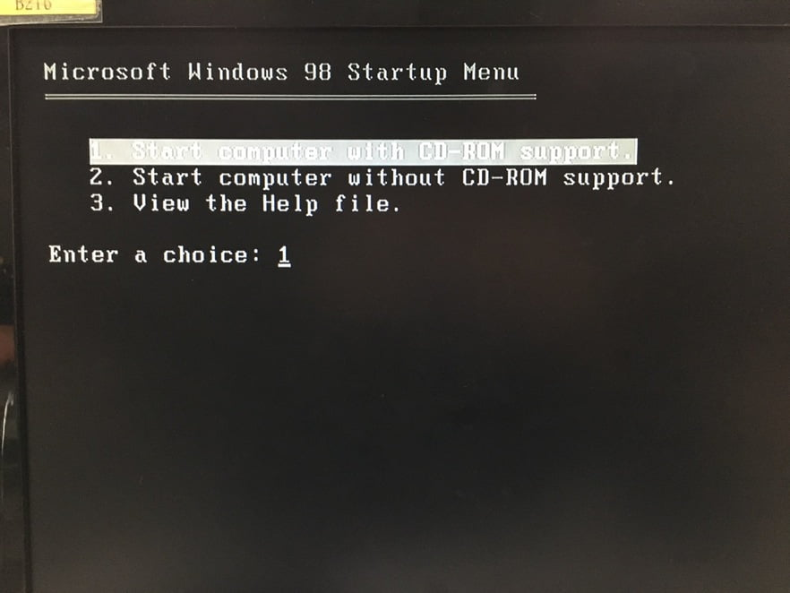
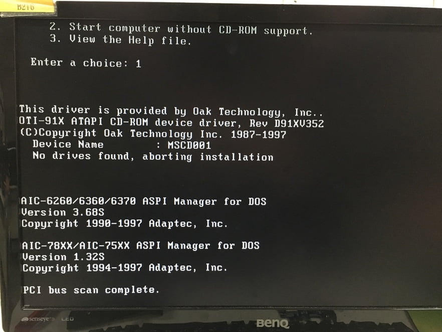
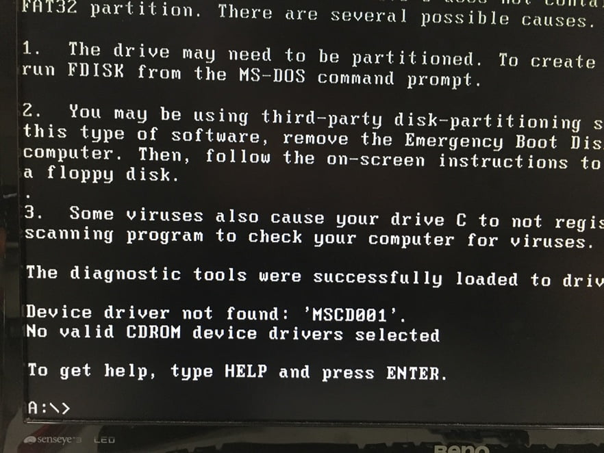
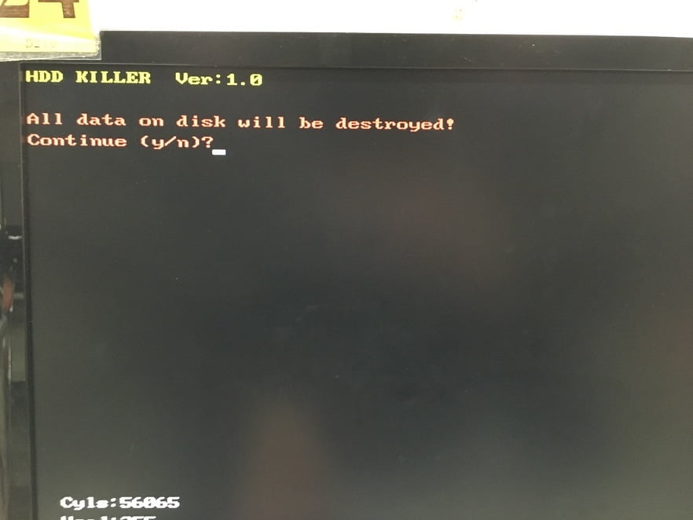

> 除了修改 BIOS 之外，還要記得拔還原卡。

## 修改 BIOS

先進 BIOS 檢查 SATA mode 是不是 IDE。如果是 AHCI，掃描程式會抓不到硬碟。

輸入密碼，進入 BIOS 後，依照圖片順序去檢查。

如果有修改設定，記得先儲存設定在重新開機。

## RHD

> 洗硬碟，可以把它想成格式化，只是它清得比格式化還乾淨。

將要清理的硬碟插好後，放入光碟然後開機。如果失敗，檢查 SATA mode 是否有改成 IDE，或是將 SATA 換插槽。

開機後請按 `F12` 鍵，選擇用光碟開機，會進到這個畫面，請選擇 1。

接下來會跑一些檢測程序。

跑完後請輸入 `rhd`，按 Enter 鍵。

輸入 `y`，按 Enter 鍵，完成！

