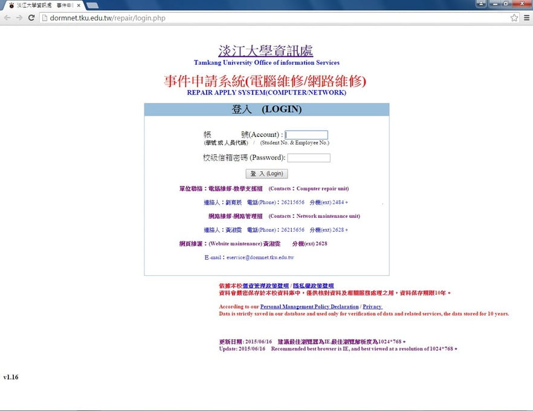
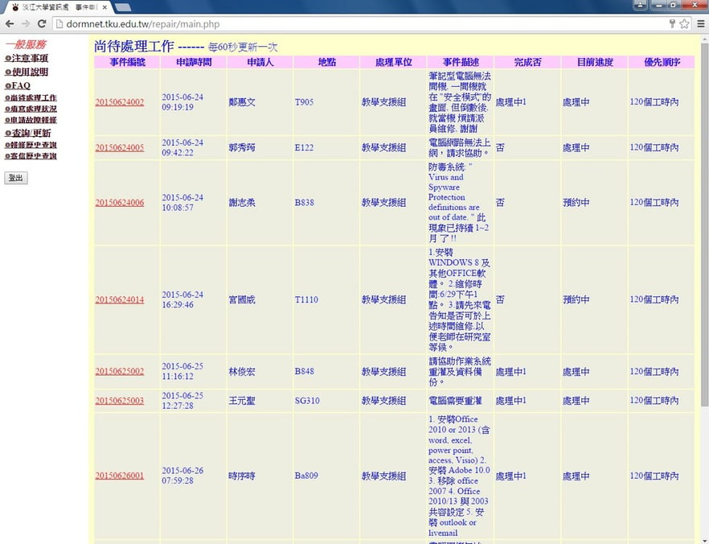
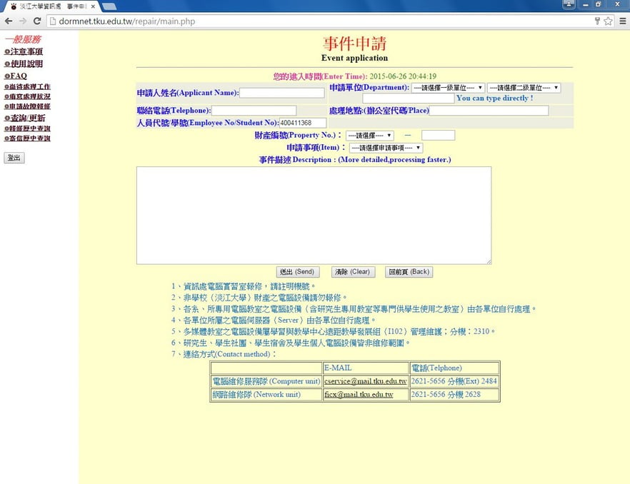
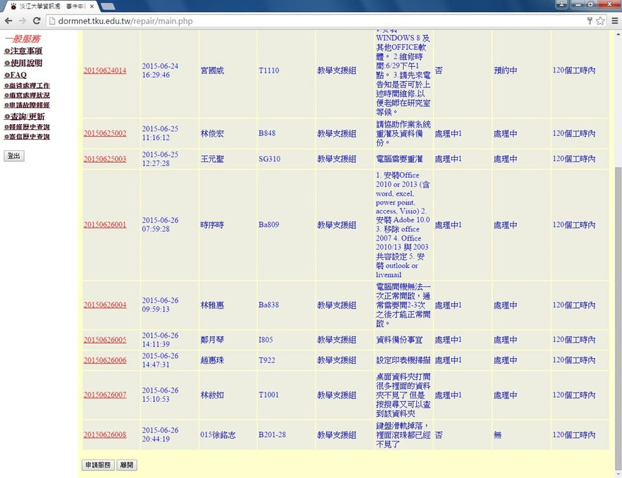
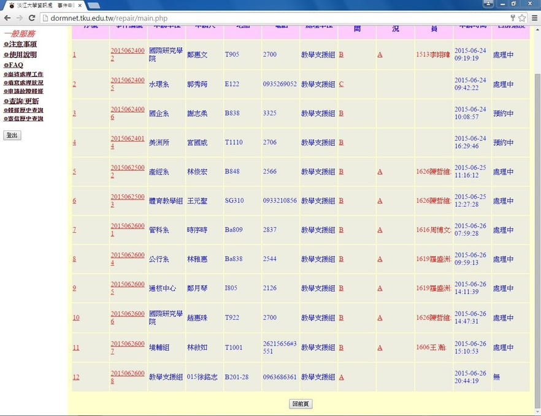
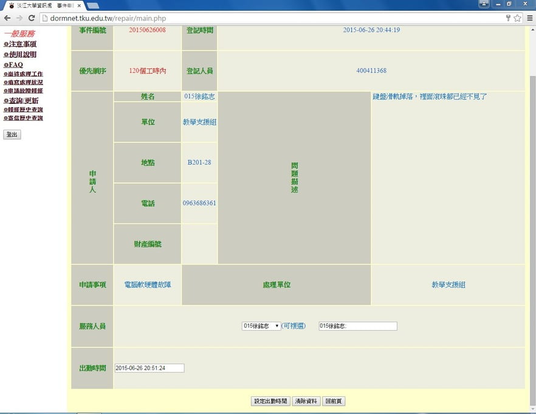
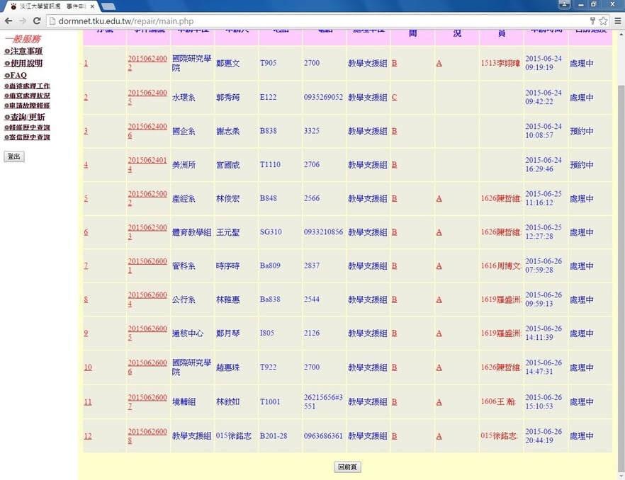
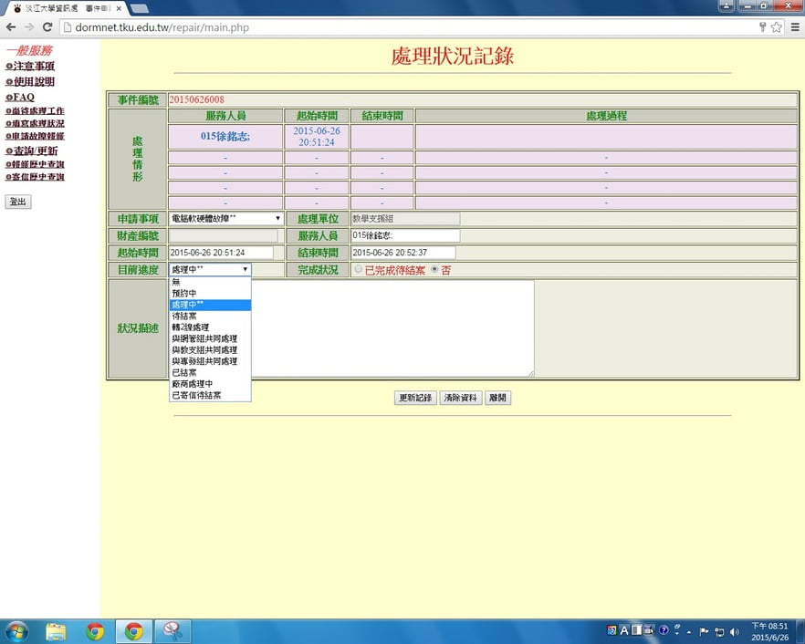

電腦、印表機及實習室內電腦相關設備（如耳機、滑鼠、鍵盤、鍵盤架、螢幕等等）若有發生故障依狀況決定需要申請故障維修的時候，請打開桌面的事件申請系統頁面進行開單的動作。

事件申請系統網址：<http://dormnet.tku.edu.tw/repair/>

## 一般狀況處理

1. 進入到系統頁面後，把輸入帳號密碼後點登入。

   

2. 成功登入後，就可以看到有哪些單子要去處理的，我們比較需要注意的是 B201、B203、B204、B206、B216、B217、B218、B130、B113 以及 E313、E314 這幾個地方的單。

   

3. 假如有故障要開單的話，點選左方的「申請故障報修」後，會進入到下圖的頁面。

   

    - **姓名**：請填上你的編號＋姓名，例：`010XXX`。
    - **申請單位**：一級單位請選擇資訊處，二級單位請選教學支援組。
    - **處理地點**：
        - 電腦填 例：`B201-01`，B201 代表哪間實習室電腦出問題，01 指一號電腦，螢幕上都有編號。
        - 印表機填 例：`B201-L1`，L1 是指第一台印表機，印表機上會有標籤。
    - **學號**：填上你的學號。
    - **財產編號**：不用填。
    - **申請事項**：我們只會用到印表機故障或是電腦軟硬體故障這兩個，其他不要選。
    - **事件描述**：這邊描述得越詳細越好，下一個人處理時會比較容易去了解狀況。

4. 填寫完送出後就會自動跳到「尚待處理工作」頁面，而剛剛開的單就會在最下方。

   

5. 假如之前有單沒處理完，而要去處理時，請點選左側的「填寫處理狀況」，會跳到下圖的頁面，一般來說剛開完的或是還沒處理的單，都只會有 A 可以點，如果出現 B 或 C 代表先前有人處理過了。

   

6. 根據上圖的例子，點選 A 後會進到這個頁面，其他地方都不用動，按設定出勤，這時就可以去進行維修。

   

7. 回到「填寫處理狀況」的頁面。

   

8. 假如已經把故障狀況處理完畢後，可以再點一次 A，會進到處理狀況記錄。

   在完成狀況這邊選「已完成待結案」，目前進度選擇「待結案」，並且將處理的情況填在狀況描述這邊，按更新紀錄後這張單就會從「尚待處理工作」消失。

   

## 轉單

如果是有要把印表機送去 B219 維修隊那邊換備品回來，完成狀況這邊依然選否，目前進度不用更改，狀況描述可以填「更換備品後轉維修隊處理」，按下更新紀錄後，再跟維修隊說有單轉過去。

